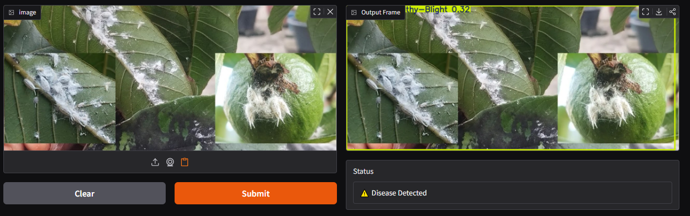

## 🌿 Plant Disease Detection System (YOLOv8 + Gradio)

A deep learning-based plant disease detection system using Ultralytics YOLOv8 and a Gradio web interface, deployed on Hugging Face Spaces. The model classifies and detects plant leaf conditions and highlights diseases in real-time.
## 🚀 Demo
## 📷 Example Output

### Healthy Plant vs Diseased Plant Prediction

## 👉 Upload a leaf image and the system will:

Detect plant type
Identify diseases
Show bounding boxes for infected leaves
Indicate whether the plant is healthy or diseased

## 📌 Classes Supported

-Eggplant Healthy
-Eggplant Unhealthy – Mosaic Virus
-Eggplant Unhealthy – White Mold
-Guava Healthy
-Guava Unhealthy – Phytophthora
-Guava Unhealthy – Red Rust
-Pepper Healthy
-Pepper Unhealthy – Blight
-Pepper Unhealthy – Fruit Rot

## 🧠 Model Details
Model: YOLOv8 (Nano / Custom Trained)
Framework: Ultralytics YOLOv8
Input Size: 640x640
Task: Object Detection
Dataset: Plant disease image dataset (custom annotated)

## ⚙️ Installation

## Install dependencies:

pip install -r requirements.txt
📦 Requirements
ultralytics
gradio
pillow
opencv-python-headless

## ▶️ Run Locally

python app.py

Then open:

http://127.0.0.1:7860

## 🧪 How It Works

User uploads an image
YOLOv8 processes the image
Model detects leaves and diseases
System checks class labels:
If “Unhealthy” → Disease detected
If “Healthy” → No disease
Output image is displayed with or without bounding boxes

## 🖼️ Output Behavior

Condition	Output
Healthy Plant	Original image (no bounding boxes)
Diseased Plant	Bounding boxes + annotation
No detection	Original image + "Healthy" status
📊 Model Performance
Precision: ~0.65
Recall: ~0.59
mAP50: ~0.59
mAP50-95: ~0.44

## ⚠️ Limitations

Performance depends on dataset quality
Weak detection on underrepresented classes (e.g., Pepper diseases)
Sensitive to lighting and background variation

## 🔧 Future Improvements

ncrease dataset balance
Train with YOLOv8s/m for higher accuracy
Add severity classification
Improve field robustness (real farm images)
Mobile deployment (TensorFlow Lite / ONNX)

## 👨‍💻 Tech Stack
Python
Ultralytics YOLOv8
Gradio
PyTorch
Hugging Face Spaces

## 📜 License

For academic and research use only.

## 🙌 Acknowledgment

Developed for plant disease detection research and academic capstone project purposes.
